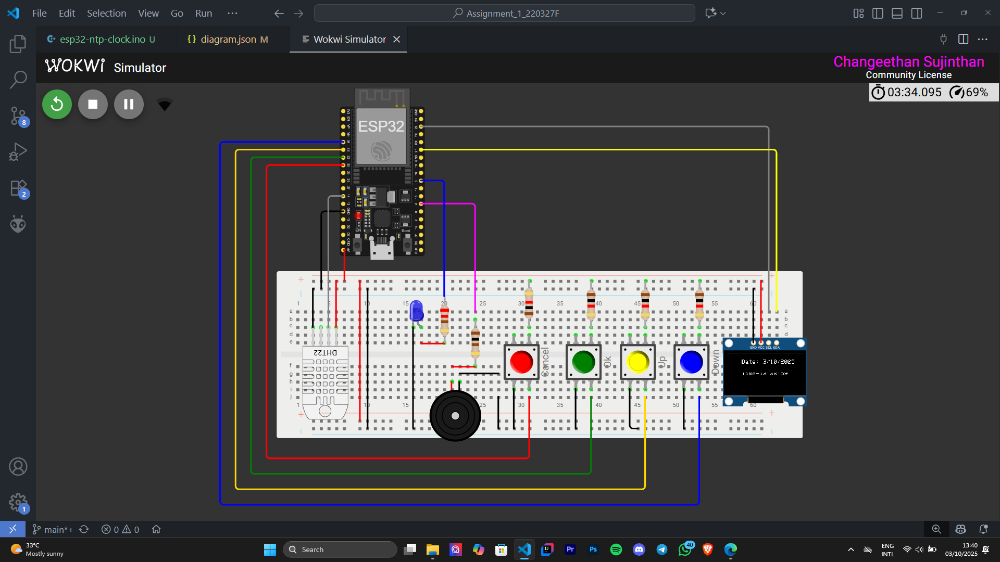

# ChronoCare Simulation – ESP32 (Embedded Systems Project)

This repository contains the implementation of **Programming Assignment 1** for the course **EN2853: Embedded Systems and Applications**.  
The project demonstrates a **ChronoCare** simulation built on **Wokwi** using an ESP32 microcontroller. The ChronoCare is designed to remind users to take their medicine on time and monitor environmental conditions.

---

## 📌 Features

- **Menu System**
  - Set time zone (UTC offset).
  - Set up to **2 alarms**.
  - View active alarms.
  - Delete specific alarms.

- **Time Synchronization**
  - Fetches current time from an **NTP server** over Wi-Fi.
  - Displays real-time clock on the **OLED display**.

- **Alarm System**
  - Rings alarm with proper indications (Buzzer, LED, or OLED message).
  - **Stop** alarm with push button.
  - **Snooze** option (5 minutes).

- **Environment Monitoring**
  - Continuously monitors **temperature** and **humidity**.
  - Provides **warnings** when readings exceed healthy limits:
    - Temperature: 24 °C – 32 °C  
    - Humidity: 65% – 80%

---

## 🛠️ Tools & Technologies

- **ESP32 Microcontroller**
- **Wokwi Simulator**
- **OLED Display**
- **Push Buttons**
- **Buzzer / LEDs**
- **DHT Sensor** (for temperature & humidity monitoring)

---

## 🖥️ Wokwi Simulation

  

---

## License
This project is licensed under the MIT License. See the LICENSE file for details.

